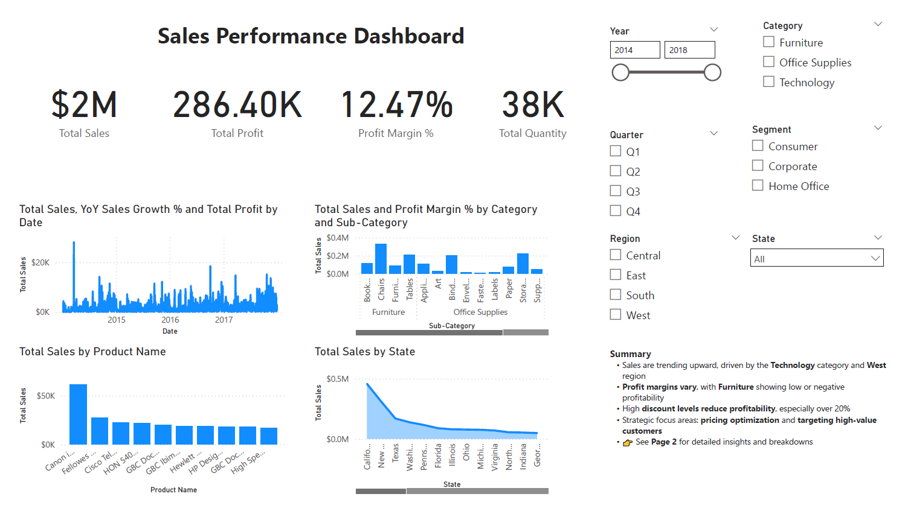

# 📊 Sales Performance Dashboard (Sample Superstore Dataset)

**Tools:** Power BI Desktop  
**Dataset:** Sample Superstore (Orders)

## 🚀 Project Overview
This interactive Power BI dashboard analyzes sales performance across time, regions, product categories, and customer segments. Designed to support data-driven decision-making, it provides a comprehensive view of business health using key performance metrics and time-based comparisons.

## 🛠️ Key Features
- **KPI Cards** for Total Sales, Profit, Quantity, and Profit Margin %
- **Sales Trends** over time with Year-to-Date (YTD) and YoY comparisons
- **Geographic Analysis** using maps to show regional and state-level performance
- **Product Performance** by Category, Sub-Category, and Top 10 Products
- **Interactive Slicers** for Date, Region, Category, and Segment
- **Drillthrough Pages** for detailed product and region views
- **Custom DAX Measures** for dynamic business insights

## 📈 Insights
- The **West region** had the highest sales, but not the highest profit margin.
- **Technology** products brought the highest sales, but **Office Supplies** had better profitability.
- Several states operated at a **net loss**, suggesting regional strategy adjustments are needed.
- **Top 10 products** contributed to a disproportionately high share of total revenue.

## 📂 File Structure
- `SalesDashboard.pbix`: Power BI project file
- `images/`: Screenshots of visuals
- `README.md`: Project documentation

## ✅ Skills Demonstrated
- Data modeling and relationship management
- DAX calculations for YTD, LY, and growth %
- Time intelligence using a custom date table
- Drill-downs, tooltips, and slicer interactivity

 ()

- ---

## 👤 Author
**[Morgan Johnson]**  
Conscientious and inquisitive data analyst with strong skills in Power BI, DAX, storytelling, and HR data insights.

📎 [LinkedIn](https://www.linkedin.com/in/morgan-johnson-8218b2177/) | 📂 [Portfolio](https://data-analysis-by-morgan.super.site/)

